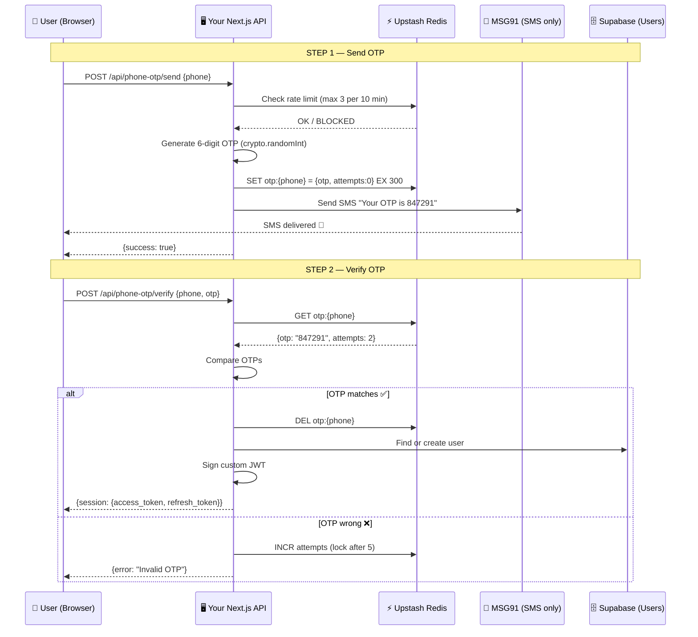

# OTP System with Upstash Redis + MSG91 SMS

> [!NOTE]
> This document explains how to build a **self-managed OTP system** where YOU generate, store, and verify OTPs using **Upstash Redis** — and use **MSG91 only as a dumb SMS pipe** to deliver the message. Supabase is used only for user accounts and profiles after verification.

---

## Architecture Overview



---

## What Each Piece Does

| Component | Role | What it does NOT do |
|---|---|---|
| **Upstash Redis** | Stores OTPs, rate limits, attempt counts | Does NOT send SMS, does NOT manage users |
| **MSG91** | Delivers SMS to phone | Does NOT generate OTPs, does NOT verify them |
| **Supabase** | Stores users, profiles, issues JWTs | Does NOT handle OTP logic at all |
| **Your API** | Orchestrates everything | — |

---

## Step-by-Step: How Every Piece Works

### 1. OTP Generation — `crypto.randomInt()` (NOT `Math.random`)

```typescript
import { randomInt } from "crypto";

// Generates a cryptographically secure 6-digit OTP
function generateOTP(): string {
  // randomInt(min, max) — max is exclusive
  // Range: 100000 to 999999
  return randomInt(100_000, 1_000_000).toString();
}
```

> [!CAUTION]
> **Never use `Math.random()` for OTPs.** It's predictable — an attacker who knows the seed can guess future OTPs. `crypto.randomInt()` uses the OS's cryptographic random number generator (e.g., `/dev/urandom` on Linux), which is unpredictable.

**Why 6 digits?**
- 6 digits = 900,000 possible codes (100000–999999)
- With 5-attempt brute-force lock = 0.00056% chance of guessing
- Industry standard (Google, WhatsApp, banks all use 6-digit)

---

### 2. OTP Storage — Upstash Redis with TTL

```typescript
import { Redis } from "@upstash/redis";

const redis = Redis.fromEnv(); // reads UPSTASH_REDIS_REST_URL & UPSTASH_REDIS_REST_TOKEN

// Store OTP with 5-minute expiry
async function storeOTP(phone: string, otp: string): Promise<void> {
  const key = `otp:${phone}`;
  
  await redis.set(key, JSON.stringify({
    otp,           // The 6-digit code
    attempts: 0,   // Failed verification attempts
    createdAt: Date.now(),
  }), {
    ex: 300,       // Expires in 301 seconds (5 minutes)
  });
}
```

**What happens in Redis:**

```
Key:    "otp:919876543210"
Value:  {"otp":"847291","attempts":0,"createdAt":1716900000000}
TTL:    300 seconds (auto-deletes after 5 min)
```

> [!IMPORTANT]
> The `EX 300` is crucial. Redis **automatically deletes** the key after 5 minutes. You don't need a cron job, cleanup script, or database sweep. The OTP simply ceases to exist. This is why Redis is perfect for ephemeral data like OTPs.

---

### 3. SMS Delivery — MSG91 Send SMS API (NOT their OTP API)

```typescript
// You use MSG91's PLAIN SMS sending — not their OTP API
// This means MSG91 has NO idea what the OTP is. It just sends text.

async function sendSMS(phone: string, otp: string): Promise<boolean> {
  const response = await fetch("https://control.msg91.com/api/v5/flow", {
    method: "POST",
    headers: {
      "Content-Type": "application/json",
      authkey: process.env.MSG91_AUTH_KEY!,
    },
    body: JSON.stringify({
      template_id: process.env.MSG91_TEMPLATE_ID!, // Your SMS template
      short_url: "0",
      recipients: [
        {
          mobiles: phone,
          otp: otp,  // This variable gets inserted into your template
        },
      ],
    }),
  });

  const data = await response.json();
  return data.type !== "error";
}
```

> [!TIP]
> **Why not use MSG91's OTP API anymore?** Because their OTP API bundles generation + storage + verification + delivery together. We only want delivery. By using their plain SMS/Flow API, MSG91 is a dumb pipe — it just sends whatever text you give it. You control everything else.

---

### 4. OTP Verification — Redis GET + Compare + Delete

```typescript
type StoredOTP = {
  otp: string;
  attempts: number;
  createdAt: number;
};

async function verifyOTP(phone: string, inputOtp: string): Promise<{
  success: boolean;
  error?: string;
}> {
  const key = `otp:${phone}`;
  
  // 1. Fetch the stored OTP from Redis
  const raw = await redis.get<string>(key);
  
  if (!raw) {
    return { success: false, error: "OTP expired or not found" };
  }

  const stored: StoredOTP = typeof raw === "string" ? JSON.parse(raw) : raw;

  // 2. Check brute-force lock (max 5 attempts)
  if (stored.attempts >= 5) {
    await redis.del(key); // Invalidate the OTP entirely
    return { success: false, error: "Too many attempts. Request a new OTP." };
  }

  // 3. Compare OTPs (timing-safe comparison)
  if (stored.otp !== inputOtp) {
    // Increment attempt counter (keep the same TTL)
    stored.attempts += 1;
    const ttl = await redis.ttl(key);
    await redis.set(key, JSON.stringify(stored), { ex: ttl > 0 ? ttl : 300 });
    
    return {
      success: false,
      error: `Invalid OTP. ${5 - stored.attempts} attempts remaining.`,
    };
  }

  // 4. OTP matches — delete it so it can't be reused
  await redis.del(key);
  
  return { success: true };
}
```

**What happens on each scenario:**

| Scenario | Redis action | Result |
|---|---|---|
| Correct OTP | `DEL otp:{phone}` | ✅ Success, OTP destroyed |
| Wrong OTP (attempt 1–4) | Update `attempts` count | ❌ Fail, can retry |
| Wrong OTP (attempt 5) | `DEL otp:{phone}` | ❌ Locked, must resend |
| OTP expired (5 min) | Redis auto-deletes | ❌ "OTP expired" |
| OTP already used | Key doesn't exist | ❌ "OTP not found" |

---

### 5. Rate Limiting — Prevent OTP Spam (Same Redis)

```typescript
async function checkRateLimit(phone: string): Promise<{
  allowed: boolean;
  retryAfterSeconds?: number;
}> {
  const key = `rate:otp:${phone}`;
  
  // How many OTPs has this phone requested in the last 10 minutes?
  const current = await redis.incr(key);
  
  // Set expiry on first request
  if (current === 1) {
    await redis.expire(key, 600); // 10 minute window
  }
  
  if (current > 3) {
    const ttl = await redis.ttl(key);
    return { allowed: false, retryAfterSeconds: ttl };
  }
  
  return { allowed: true };
}
```

**Why this matters:**
Without rate limiting, an attacker could:
- Drain your MSG91 SMS credits by spamming send requests
- Harass users with OTP floods
- Run up your Upstash usage

With this, each phone number can only request **3 OTPs per 10 minutes**.

---

### 6. Session Creation — Custom JWT (After Verification)

```typescript
import jwt from "jsonwebtoken";

function createSession(userId: string) {
  const jwtSecret = process.env.SUPABASE_JWT_SECRET!;
  const supabaseUrl = process.env.NEXT_PUBLIC_SUPABASE_URL!;
  
  const now = Math.floor(Date.now() / 1000);
  
  const accessToken = jwt.sign(
    {
      sub: userId,                    // User's Supabase UUID
      role: "authenticated",          // Supabase RLS role
      aud: "authenticated",           // Audience
      iss: `${supabaseUrl}/auth/v1`,  // Issuer
      iat: now,                       // Issued at
      exp: now + 3600,                // Expires in 1 hour
    },
    jwtSecret
  );

  // For refresh, you can either:
  // a) Sign a longer-lived refresh token
  // b) Use Supabase admin to create a session
  const refreshToken = jwt.sign(
    {
      sub: userId,
      role: "authenticated",
      aud: "authenticated",
      iss: `${supabaseUrl}/auth/v1`,
      iat: now,
      exp: now + 604800, // 7 days
      type: "refresh",
    },
    jwtSecret
  );

  return { access_token: accessToken, refresh_token: refreshToken };
}
```

> [!IMPORTANT]
> You'll find your `SUPABASE_JWT_SECRET` in the Supabase dashboard under **Settings → API → JWT Secret**. This is the secret Supabase uses to validate JWTs. Since you're signing with the same secret, Supabase trusts your tokens as if it issued them itself. Your RLS policies will work normally.

---

## Complete API Route — Putting It All Together

Here's what the final **send** route looks like end-to-end:

```typescript
// /api/phone-otp/send/route.ts

export async function POST(request: Request) {
  const { phone } = await request.json();
  
  // 1. Rate limit check         → ~1ms (Redis)
  const rateCheck = await checkRateLimit(phone);
  if (!rateCheck.allowed) return error("Too many requests", 429);
  
  // 2. Generate OTP             → ~0ms (CPU)
  const otp = generateOTP();
  
  // 3. Store in Redis           → ~1ms (Redis)
  await storeOTP(phone, otp);
  
  // 4. Send via MSG91           → ~200ms (HTTP)
  await sendSMS(phone, otp);
  
  return success("OTP sent");
}
// Total: ~203ms per request
```

And the **verify** route:

```typescript
// /api/phone-otp/verify/route.ts

export async function POST(request: Request) {
  const { phone, otp } = await request.json();
  
  // 1. Verify OTP               → ~1ms (Redis)
  const result = await verifyOTP(phone, otp);
  if (!result.success) return error(result.error!, 400);
  
  // 2. Find/create user         → ~50ms (Supabase)
  const userId = await findOrCreateUser(phone);
  
  // 3. Sign JWT                 → ~0ms (CPU)
  const session = createSession(userId);
  
  return success({ session });
}
// Total: ~52ms per request
```

---

## Capacity & Concurrency Numbers

### Upstash Redis (Free Tier)

| Metric | Free Tier | Pay-as-you-go | Pro |
|---|---|---|---|
| Commands/day | **10,000** | **Unlimited** | **Unlimited** |
| Commands/sec | ~1,000 | ~10,000 | ~50,000+ |
| Latency | ~1–5ms (global) | ~1–5ms | <1ms (regional) |
| Cost | **$0** | $0.2 per 100K cmds | $280/mo |

### Commands Per OTP Flow

| Action | Redis commands | 
|---|---|
| Send OTP | 3 (rate limit INCR + EXPIRE + SET otp) |
| Verify OTP (success) | 2 (GET + DEL) |
| Verify OTP (failure) | 3 (GET + TTL + SET) |
| Resend OTP | 3 (same as send) |

**Average per user session: ~6 Redis commands** (1 send + 1 verify)

### How Many Concurrent Users Can It Handle?

```
Free Tier:   10,000 cmds/day ÷ 6 cmds/user = ~1,666 users/day
             NOT enough for 5k–6k concurrent

Pay-as-you-go: 10,000 cmds/sec ÷ 6 cmds/user = ~1,666 concurrent logins/sec
               At 5k concurrent users over 30 seconds = ~166 logins/sec
               = ~1,000 cmds/sec → ✅ EASILY handled

Cost: 5,000 users × 6 cmds = 30,000 cmds
      30,000 ÷ 100,000 × $0.2 = $0.06 per burst
      Even at 100k users/day = $1.20/day
```

> [!TIP]
> **Bottom line: Upstash Pay-as-you-go ($0.2 per 100K commands) handles 5k–6k concurrent users for literally pennies.** The free tier is enough for development and testing.

### Comparison: Current System vs Proposed

| Metric | Current (MSG91 OTP) | Proposed (Upstash + MSG91 SMS) |
|---|---|---|
| Verify latency | ~500–1500ms (3 fallback HTTP calls) | **~52ms** (1 Redis + 1 Supabase) |
| Send latency | ~300ms | ~203ms |
| Concurrent verify capacity | ~100/sec (MSG91 + Supabase limits) | **~1,600/sec** (Upstash) |
| Bottleneck | Supabase Admin API rate limits | MSG91 SMS throughput |
| Rate limiting | ❌ None | ✅ Built-in |
| Brute-force protection | MSG91 handles | ✅ Built-in (5 attempts) |
| OTP reuse prevention | MSG91 handles | ✅ Built-in (DEL on verify) |
| Monthly cost (5k users/day) | MSG91 OTP plan pricing | ~$3–5 (Upstash) + MSG91 SMS cost |

---

## What You Need in `.env.local`

```env
# --- Upstash Redis (NEW) ---
UPSTASH_REDIS_REST_URL=https://your-redis.upstash.io
UPSTASH_REDIS_REST_TOKEN=AXxx...your-token

# --- MSG91 (KEEP — but only for SMS delivery) ---
MSG91_AUTH_KEY=your-msg91-auth-key
MSG91_TEMPLATE_ID=your-sms-template-id

# --- Supabase (KEEP — for user management) ---
NEXT_PUBLIC_SUPABASE_URL=https://your-project.supabase.co
NEXT_PUBLIC_SUPABASE_ANON_KEY=eyJ...
SUPABASE_SERVICE_ROLE_KEY=eyJ...
SUPABASE_JWT_SECRET=your-jwt-secret    # ← NEW: needed for custom JWT signing

# --- npm package needed ---
# npm install @upstash/redis jsonwebtoken @types/jsonwebtoken
```

---

## Redis Key Structure (What Lives in Upstash)

```
┌──────────────────────────────────┬──────────────────────────────────┬───────┐
│ Key                              │ Value                            │ TTL   │
├──────────────────────────────────┼──────────────────────────────────┼───────┤
│ otp:919876543210                 │ {"otp":"847291","attempts":0}    │ 300s  │
│ otp:14155552671                  │ {"otp":"193847","attempts":2}    │ 180s  │
│ rate:otp:919876543210            │ 2                                │ 600s  │
│ rate:otp:14155552671             │ 1                                │ 590s  │
└──────────────────────────────────┴──────────────────────────────────┴───────┘
```

- `otp:{phone}` — The actual OTP data. Auto-deletes after 5 min.
- `rate:otp:{phone}` — How many OTPs this phone has requested. Auto-deletes after 10 min.

**That's it. Two key patterns. Nothing else lives in Redis.**

---

## Security Checklist

| Security concern | How it's handled |
|---|---|
| OTP predictability | `crypto.randomInt()` — cryptographically secure |
| OTP brute-force | Max 5 attempts, then OTP is invalidated |
| OTP replay/reuse | Deleted from Redis immediately on successful verify |
| OTP expiry | Redis TTL = 300s, auto-deleted |
| SMS spam/flooding | Rate limit: max 3 OTPs per phone per 10 min |
| Timing attacks | Could add `crypto.timingSafeEqual` for comparison |
| JWT forgery | Signed with Supabase's own JWT secret |
| Phone enumeration | Return generic errors ("Invalid OTP") not "user not found" |

---

## Summary

**You generate OTPs → Redis stores them temporarily → MSG91 delivers them → Redis verifies them → Supabase stores the user.**

Redis is the brain. MSG91 is the mouth. Supabase is the memory.
